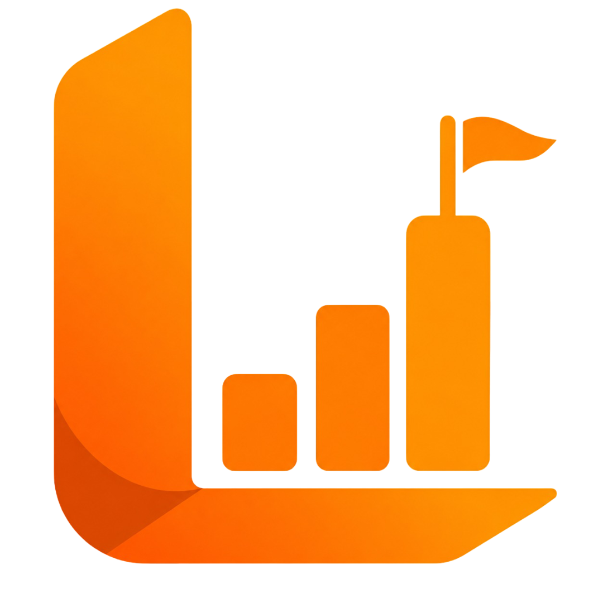

<div align="center">
  
  <h1>Leet Companies</h1>
  <p><strong>Explore 470+ Company-Wise LeetCode Interview Questions, Frequency Heatmaps & Overlap Matrix</strong></p>

  <p>
    <a href="https://leetcompanies.netlify.app"></a>
    <a href="https://github.com/MuhammadAzaan/Leetcode-Companies/blob/main/LICENSE"></a>
    
    
    
  </p>
</div>

---

## 🌟 Overview

**Leet Companies** is a fast, modern, and completely client-side web application designed to help software engineers crack technical interviews by practicing real, frequency-sorted LeetCode questions asked by **470+ top tech companies** (Google, Meta, Amazon, Microsoft, Bloomberg, Apple, Goldman Sachs, Uber, and more).

Unlike other interview tools, **Leet Companies requires no sign-ups and performs zero server-side tracking**. All your solved problems, revision bookmarks, and custom notes are stored 100% locally in your browser with instant JSON export and backup capabilities.

---

## ⚡ Key Features

* 🏢 **470+ Company Question Sheets**: Explore curated question lists categorized by Big Tech (FAANG), Quantitative Hedge Funds (HFT), Fintech & Banking, and High-Growth Startups.
* ⏱️ **Timeframe Frequency Filters**: Filter interview questions asked in the **Last 30 Days**, **Last 3 Months**, **Last 6 Months**, or **All Time** with real frequency percentages.
* 🔀 **Multi-Company Overlap Matrix**: Select multiple target companies to find shared, high-yield questions and save hundreds of prep hours.
* 🔍 **Universal Problem Search**: Search any algorithmic topic (Dynamic Programming, Graphs, Two Pointers) or problem name to instantly see every company that asks it.
* 🎲 **"Pick Random" Simulator**: Practice mock rounds with random question pickers filtered by difficulty and company.
* 🔒 **100% Client-Side Privacy**: Zero telemetry, zero accounts. Notes, solved markers, and starred questions stay strictly in your browser (`localStorage`).
* 📦 **Data Portability**: One-click JSON progress export and import across devices.
* 📱 **Full Mobile & Tablet Support**: Optimized touch navigation, horizontal pill scrolling, and responsive data tables.
* 🌓 **Dark & Light Themes**: Sleek, glassmorphic Tech-Noir dark theme alongside a clean light mode.

---

## 🛠️ Tech Stack

* **Framework**: [React 19](https://react.dev/)
* **Build Tool**: [Vite 6](https://vitejs.dev/)
* **Icons**: [Lucide React](https://lucide.dev/)
* **Styling**: Vanilla Modern CSS System with CSS Variables & Glassmorphism
* **Storage**: Browser `localStorage` API + JSON Export/Import Engine
* **Deployment**: [Netlify](https://www.netlify.com/)

---

## 🚀 Getting Started

### Prerequisites
* [Node.js](https://nodejs.org/) (v18.0.0 or higher recommended)
* [npm](https://www.npmjs.com/) or [yarn](https://yarnpkg.com/)

### Installation & Setup

1. **Clone the repository**:
   ```bash
   git clone https://github.com/your-username/Leetcode-Companies.git
   cd Leetcode-Companies
   ```

2. **Install dependencies**:
   ```bash
   npm install
   ```

3. **Start local development server**:
   ```bash
   npm run dev
   ```
   Open `http://localhost:5173` in your browser.

4. **Build for production**:
   ```bash
   npm run build
   ```
   The production-ready assets will be generated in the `dist/` directory.

---

## 📱 More Apps by AZN Labs

Check out our native Android tools available on the Google Play Store:

* ⏰ **[Any Alarm: Hardcore Wake Up & GPS Commute](https://play.google.com/store/apps/details?id=com.aznenterprises.anyalarm)** – Stop snoozing with Math puzzles, QR barcode scans, step counter challenges, and location-based GPS arrival alarms.
* 💰 **[NET Expense Manager](https://play.google.com/store/apps/details?id=com.aznenterprises.tracksmith)** – Simple, fast, and 100% offline daily budget tracking with home screen widgets and visual analytics.
* 🎮 **[MineSaves: MCPE World Backup](https://play.google.com/store/apps/details?id=com.aznenterprises.mcpebackup)** – Professional one-tap `.mcworld` backup vault, custom thumbnail cropper, and smart restore tool for Minecraft Bedrock players.

👉 **[View AZN Labs on Google Play](https://play.google.com/store/apps/developer?id=AZN+Enterprises)**

---

## ⚖️ Disclaimer

* This project is an independent open-source tool developed purely for educational and interview preparation purposes.
* "LeetCode" and related trademarks are the property of LeetCode LLC. This project is not affiliated with, endorsed by, or sponsored by LeetCode or any of the mentioned companies.
* All company names, logos, and trademarks mentioned belong to their respective holders.

---

## 📄 License

This project is open-source and available under the [MIT License](LICENSE).

---

<div align="center">
  <sub>Developed with ❤️ by <a href="https://github.com/MuhammadAzaan">Muhammad Azaan M R</a> • Part of the <strong>AZN Labs</strong> Ecosystem</sub>
</div>

